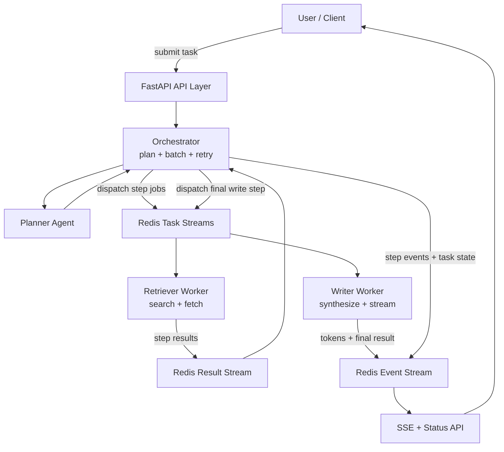

# Agentic AI System for Multi-Step Tasks

Backend-only agentic AI system that accepts a complex task, breaks it into steps, assigns those steps to specialized agents, coordinates them asynchronously through Redis Streams, and streams partial progress back to the client with Server-Sent Events.

## Highlights

- Multi-step task planning with a dedicated planner agent
- Specialized agent boundaries: Planner, Retriever, Writer
- Async orchestration with manual DAG batching
- Redis Streams message queue with consumer groups
- SSE streaming for live task progress and token output
- Retry and fallback handling across multiple LLM providers
- Local Windows-friendly setup using Memurai as a Redis-compatible server

## Architecture Diagram



## How It Works

1. The client submits a complex task to `POST /task`.
2. The API creates a `task_id` and hands the task to the orchestrator.
3. The planner agent produces a dependency-aware step plan.
4. The orchestrator batches steps by dependency level and dispatches ready work through Redis Streams.
5. The retriever worker gathers external context from web search and page content.
6. The writer worker synthesizes the final answer from prior step outputs.
7. Progress events and writer tokens are published to the per-task event stream.
8. The API exposes those events live through SSE until the task completes.

## Agent Responsibilities

| Agent | Responsibility | Input | Output |
|---|---|---|---|
| Planner | Breaks the user task into a valid execution plan | Raw task | Step DAG |
| Retriever | Finds and extracts supporting external context | Search-style step input | Documents, sources, summary |
| Writer | Produces the final synthesized answer | Original task + prior results | Streamed answer |

## Tech Stack

| Layer | Technology |
|---|---|
| API | FastAPI |
| Runtime | Python `asyncio` |
| Queue | Redis Streams |
| Redis-compatible local server | Memurai |
| Streaming | `sse-starlette` |
| HTTP | `httpx` |
| Search | DuckDuckGo + HTML fallback |
| Parsing | BeautifulSoup |
| Config | `pydantic-settings` |
| Testing | `pytest`, `pytest-asyncio` |

## Queue Design

### Streams

- `task_stream:retriever`
- `task_stream:writer`
- `result_stream`
- `event_stream:{task_id}`

### Why Redis Streams

- simple local setup
- consumer groups for worker scaling
- pending message recovery for retry handling
- good fit for assignment-scale async orchestration

## API

### `POST /task`

Creates a task and starts backend execution.

Request:

```json
{
  "task": "Compare the top open-source LLMs for coding and recommend one."
}
```

Response:

```json
{
  "task_id": "uuid",
  "status": "RECEIVED",
  "stream_url": "/task/<task_id>/stream",
  "status_url": "/task/<task_id>/status"
}
```

### `GET /task/{task_id}/stream`

Streams live events such as:

- `plan_ready`
- `step_started`
- `step_done`
- `stream_token`
- `step_failed`
- `task_complete`
- `task_failed`

### `GET /task/{task_id}/status`

Returns the current lifecycle state, step statuses, and the final result when available.

### `GET /health`

Returns service and Redis connectivity health.

## Local Setup

### Prerequisites

- Python 3.12
- Memurai running on `127.0.0.1:6379`
- API keys in `.env`

### 1. Install dependencies

```powershell
cd E:\Big_Prj\Multi_Agent
& 'C:\Users\admin\AppData\Local\Programs\Python\Python312\python.exe' -m pip install -r requirements.txt
```

### 2. Configure environment

Copy `.env.example` to `.env` and fill in:

```env
GROQ_API_KEY=your_groq_api_key_here
GEMINI_API_KEY=your_gemini_api_key_here
TOGETHER_API_KEY=your_together_api_key_here
```

### 3. Start Memurai

Make sure the `Memurai` Windows service is running.

### 4. Start the backend

```powershell
& 'C:\Users\admin\AppData\Local\Programs\Python\Python312\python.exe' -m uvicorn app.main:app --host 127.0.0.1 --port 8000 --reload
```

### 5. Verify health

```powershell
Invoke-RestMethod -Uri http://127.0.0.1:8000/health
```

Expected:

```json
{
  "status": "ok",
  "redis": "connected"
}
```

## Local Demo Flow

### Terminal 1: run the backend

```powershell
cd E:\Big_Prj\Multi_Agent
& 'C:\Users\admin\AppData\Local\Programs\Python\Python312\python.exe' -m uvicorn app.main:app --host 127.0.0.1 --port 8000 --reload
```

### Terminal 2: create a task

```powershell
$task = Invoke-RestMethod -Method Post -Uri http://127.0.0.1:8000/task -ContentType 'application/json' -Body '{"task":"Compare the top open-source LLMs for coding and recommend one."}'
$task
```

### Terminal 3: watch live SSE events

```powershell
curl.exe -N ("http://127.0.0.1:8000" + $task.stream_url)
```

### Optional: poll task status

```powershell
Invoke-RestMethod -Uri ("http://127.0.0.1:8000" + $task.status_url)
```

## Reliability Design

- Planner timeout or failure falls back to a default 2-step plan
- LLM calls retry with exponential backoff
- Provider order is `Groq -> Gemini -> Together`
- Together is intentionally last to preserve limited quota
- Stale Redis messages can be reclaimed from pending entries
- Critical step failures fail the task
- Non-critical failures allow partial completion

## Current Behavior

- The system completes end-to-end locally
- Retriever now pulls real web sources more reliably
- Writer streams token events through SSE
- Test suite is passing

## Tests

```powershell
& 'C:\Users\admin\AppData\Local\Programs\Python\Python312\python.exe' -m pytest -q
```

## Project Structure

```text
Multi_Agent/
|-- app/
|   |-- agents/
|   |-- config/
|   |-- llm/
|   |-- models/
|   |-- queue/
|   |-- main.py
|   `-- orchestrator.py
|-- docs/
|-- tests/
|-- .env.example
|-- README.md
`-- requirements.txt
```

## Submission Docs

- [System Design](docs/system_design.md)
- [Post-Mortem](docs/post_mortem.md)
- [Video Script](docs/video_script.md)

## Notes

- This is a backend-focused MVP aligned with the assignment scope.
- Analyzer logic is intentionally merged into the writer stage to keep orchestration simpler.
- SSE replay is scaffolded but not fully implemented as a resumable stream.
